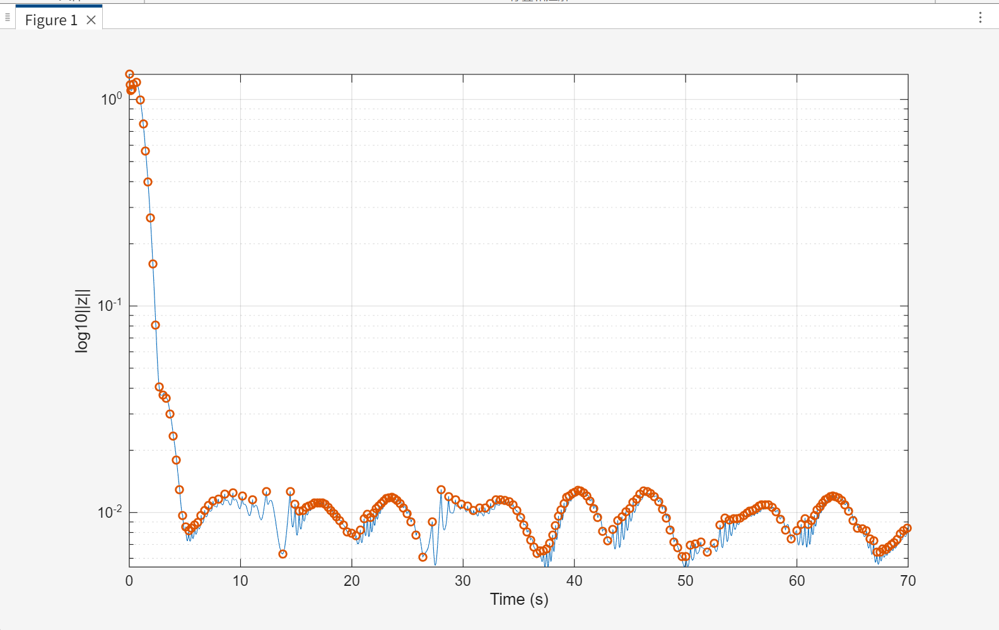
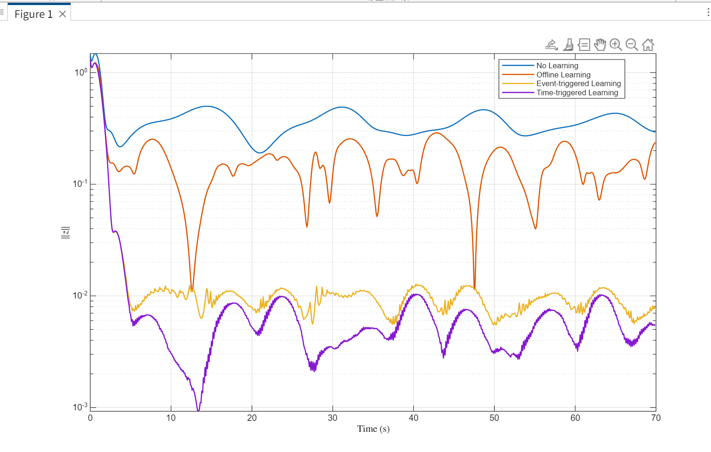

# doc2github
Code using in thesis

In simulation file:
- `main.m`: Simulation code for the proposed event-triggered online learning control method.
- `compare_all.m`: Script used to compare the performance of four methods: no learning, offline GP learning, time-triggered online learning, and event-triggered online learning.

## Simulation Results

### The effects of Eventtrigger

### Effectiveness of different methods for error control
